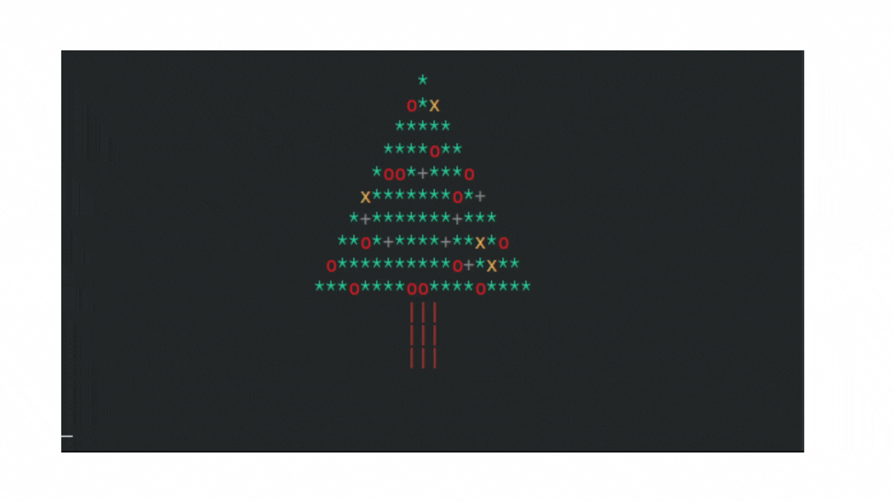

# Felicitación Navideña con Árbol

Sencillo script en Python que muiestra un árbol parpadeante con un mensaje de felicitación.

Utiliza codificación ANSI y un sistema muy básico de refresco de pantalla.

> Este efecto funciona mejor en terminales que soportan códigos ANSI y con capacidad para limpiar la pantalla. Es posible que en Windows no se vea el efecto correctamente si la terminal no tiene soporte ANSI.